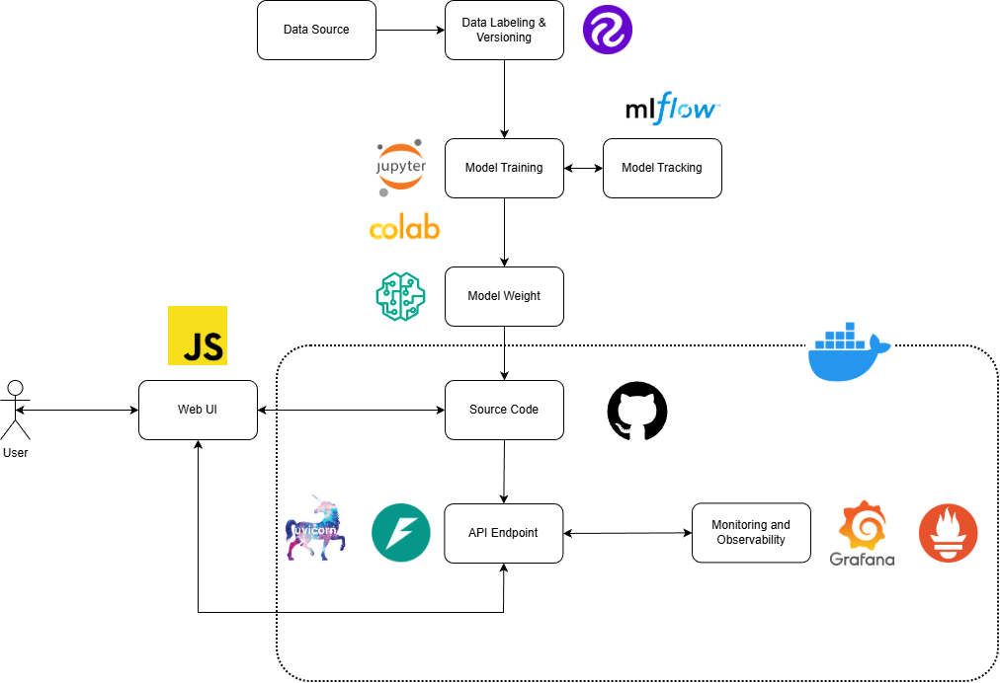

# Object Detection ตรวจจับผักในแปลง
This project implements a complete end-to-end MLOps pipeline for detecting vegetables in garden beds. The system covers everything from data labeling and model tracking to containerized deployment and real-time monitoring.

## System Architecture

## Tech Stack
| Component | Tool / Technology |
| :--- | :--- |
| **Data Labeling** | [Roboflow](https://roboflow.com/) |
| **Data Versioning** | [Roboflow](https://roboflow.com/)|
| **Development** | Jupyter Notebook / Google Colab |
| **Experiment Tracking** | [MLflow](https://mlflow.org/) |
| **Backend API** | [FastAPI](https://fastapi.tiangolo.com/) + Uvicorn |
| **Frontend** | JavaScript (Vanilla / Framework) |
| **Containerization** | [Docker](https://www.docker.com/) |
| **Version Control** | GitHub |
| **Monitoring** | [Prometheus](https://prometheus.io/) & [Grafana](https://grafana.com/) |

Workflow Breakdown
* **Data Source:** Raw images captured from garden cameras.
* **Labeling & Versioning:** Utilizing **Roboflow** to annotate vegetable classes and manage dataset versions for reproducibility.
* **Training:** Conducted in **Jupyter** or **Google Colab** environments using deep learning frameworks (e.g., YOLO or TensorFlow).
* **Model Tracking:** All hyperparameters, loss curves, and mAP scores are logged into **MLflow**, ensuring we can revert to or identify the best-performing **Model Weights**.
* **Source Code:** The core logic is managed via **GitHub**.
* **API Endpoint:** The trained model is served using **FastAPI**, providing a high-performance interface for the Web UI.
* **Containerization:** The entire serving stack (API, Monitoring) is wrapped in **Docker** for consistent deployment across environments.
* **Web UI:** A JavaScript-based interface allowing users to interact with the detection system.
* **Monitoring & Observability:** **Prometheus** scrapes metrics from the API (e.g., request latency, inference time), while **Grafana** visualizes these metrics in real-time dashboards.

